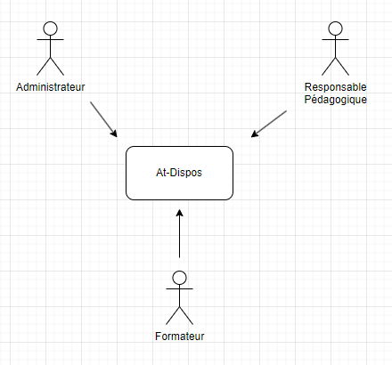
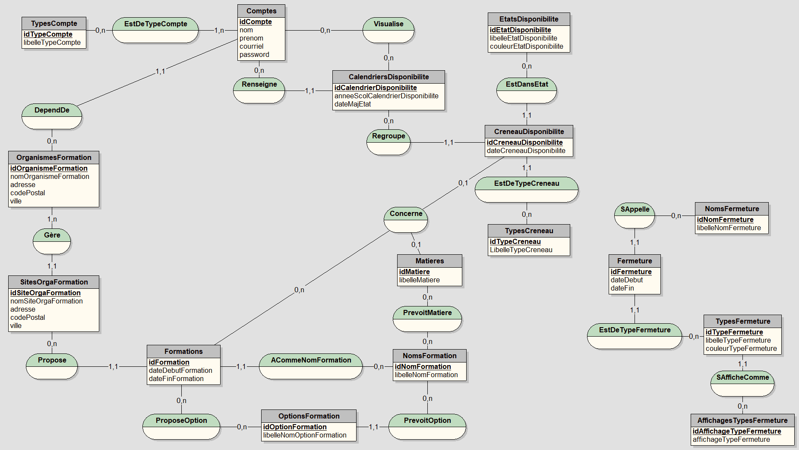
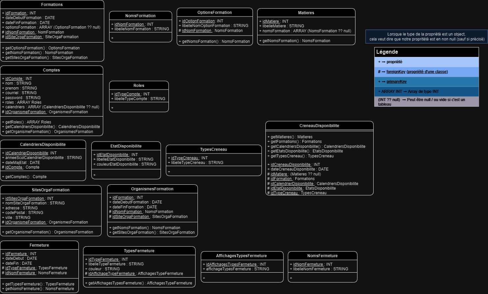
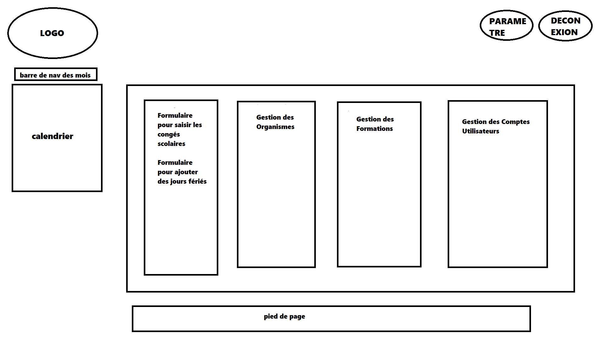
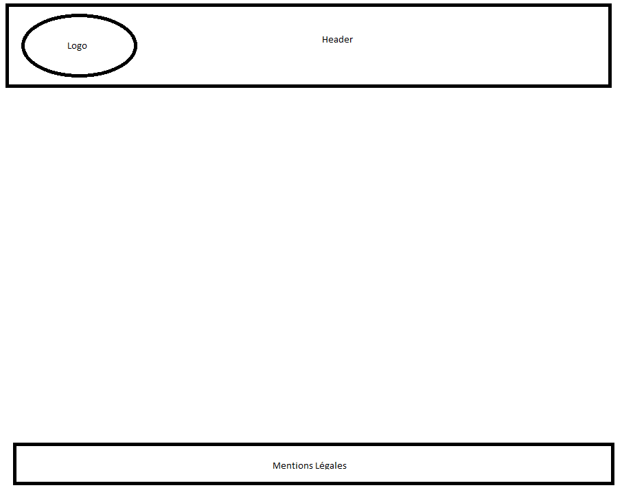
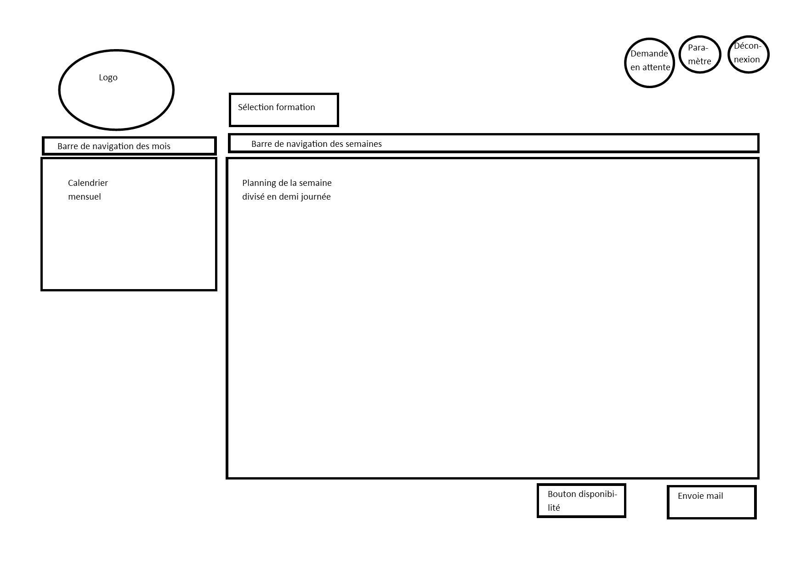

# Etude Technique :

Date de modification : 16/10/2023

Auteur : Erwan BRION / Tess NASSIVET

[TOC]

## Prérequis d'installation :

### Logiciels :

- MariaDB : Ver 15.1 Distrib 10.6.12-MariaDB

- PHP : 8.1.2-1ubuntu2.14

  

### Extensions :

#### Pour le développement :

- phpMyAdmin

- xdebug

  

#### Lors de l'installation de PHP : 

- php-mysql

- php-curl

- php-gd

- php-intl

- php-json

- php-mbstring

- php-xml

- php-zip

- libapache2-mod-php 

  

## Normes de codage utilisés :

Les normes utilisées sont : PSR-1, PSR-2, PSR-3, PSR-4.

## Diagramme de contexte statique :

## Diagramme de cas d'utilisation :

## Modèle entité-associations :

## Diagramme de classes de l'application :

## Maquettes :

