# Manuel administrateur : 

Date de modification : 19/12/2023

Auteur : Tess NASSIVET

[toc]

## Authentification :

### Page de connexion :

L’administrateur arrive automatiquement sur la page de login après installation de l'application. Une adresse de connexion et son mot de passe vous serons fournis au moment de l'installation de l'application.

Vous devrez les renseigner dans les champs "E-mail" et "Mot de passe" avant de cliquer sur "Se connecter".

C'est sur cette page de login que vous trouverez également le lien pour la création d'autre compte, ainsi que le lien vers la page de mot de passe oublié.

### Page d'inscription :

La page d'inscription est nécessaire si vous voulez proposer à des responsables pédagogiques ou des formateurs de rejoindre l'application. Pour toute inscription les mêmes champs sont à remplir :

- Nom
- Prénom
- Email 
- Mot de passe

Une fois tous les champs remplis et que l'utilisateur à cliquer sur le bouton "S'inscrire" il n'y a plus qu'à attendre que vous, administrateur validiez la demande. Pour plus de détail sur la procédure rendez-vous au chapitre "Gestion des utilisateurs" de ce manuel.

### Mot de passe oublié :

L'administrateur pourra changer son mot de passe en cliquant sur le lien en dessous des champs pour se connecter nommé "Mot de passe oublié ?". Une fois son adresse mail de compte saisie, un email lui sera envoyé. Il faudra cliquer sur lien dans le mail reçu et vous pourrez renseigner votre nouveau mot de passe.

Vous n'aurez plus qu'à revenir sur la page de login de l'application pour vous connecter.

 

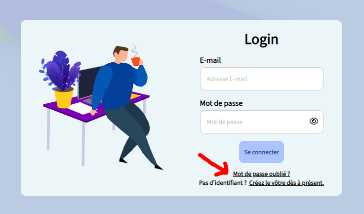

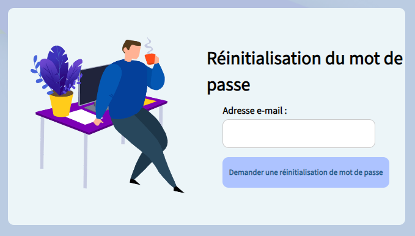

## Accueil :

### Barre de navigation :

Une fois connecté vous arrivez sur la page d'accueil avec un message de bienvenue.

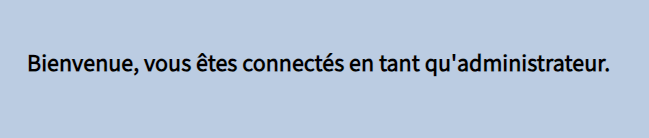

Vous trouverez sur le côté gauche de la page la barre de navigation qui vous permettra de naviguer dans l'application.

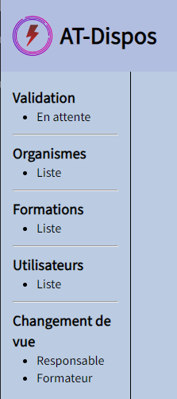

- Dans l'onglet "Validation" rubrique "En attente" vous retrouverez toutes les demandes en attente de validation, que ce soit pour les utilisateurs, les organismes, les matières ou les options.

- Dans "Organismes" rubrique "Liste" vous aurez  la page listant tous les organismes existants dans l'application. Rendez-vous au chapitre "Gestion des organismes" de ce manuel pour en savoir plus.

- Dans "Formations"  rubrique "Liste" vous aurez la page listant toutes les formations existantes. Rendez-vous au chapitre "Gestion des formations" de ce manuel pour en savoir plus (options et matières).

- Dans "Utilisateurs" rubrique "Liste" vous accèderez à la page listant tous les utilisateurs de l'application qu'ils aient été validés ou non. Rendez-vous au chapitre "Gestion des utilisateurs" de ce manuel pour en savoir plus.

A savoir : si vous vous êtes attribués les rôles "Responsable" et "Formateur" dans votre fiche personnelle, vous verrez apparaître deux boutons supplémentaires dans la navbar rubrique "Changement de vue". Elle vous permettra de naviguer dans l'application sans que vous aillez à vous déconnecter à chaque fois.

### Mentions légales :

Tout en bas du site vous verrez le lien "Mentions légales". Il vous redirigera vers les informations permettant d'identifier le responsable de l'application et les règles autour du droit d'auteur.

## Gestion des utilisateurs : 

### Les utilisateurs en attente de validation :

Lorsqu'un potentiel utilisateur de l'application fait une demande d'inscription, il doit attendre que l'administrateur valide son compte pour pouvoir ensuite se connecter.

C'est justement sur le lien "En attente" de "Validation" dans la barre de navigation du site que vous, administrateur, accèderez à la liste des demandes d'utilisateurs en attente.

Lorsqu'un utilisateur s'inscrit il remplit plusieurs informations pour vous permettre de l'identifier :

- Nom
- Prénom
- Courriel

Un utilisateur est validé et enregistré dans la base de donnée que si on lui a attribué un rôle. C'est à dire qu'avant de cliquer sur le bouton vert "Accepté", vous devez cliquer sur la barre déroulante "Choisir Rôle" et cliquer sur un des rôles proposés suivants :

- Administrateur
- Responsable
- Formateur

A savoir que chaque rôle possède des droits particuliers. Si vous souhaitez attribuer plusieurs rôles à un utilisateur choisissez celui qui est le plus important pour le moment. Vous pourrez par la suite lui attribuer d'autres rôles une fois l'utilisateur validé (pour en savoir plus rendez-vous dans le chapitre "La fiche personnelle d'un utilisateur" de ce manuel).

Si vous ne voulez pas accepter une demande vous devez juste cliquer sur le bouton rouge "Refusé". Elle sera alors supprimé et l'utilisateur ne pourra pas accéder à l'application. Si vous cliquez sur le bouton rouge par erreur, il faudra demander au futur utilisateur de refaire une demande en remplissant à nouveau le formulaire d'inscription.

### La liste des utilisateurs :

Pour voir la liste des utilisateurs contenus dans la base de donnée (validé ou non), vous devez cliquer sur le lien "Liste" dans "Utilisateurs" de la barre de navigation du site.

Vous tomberez sur cette page :

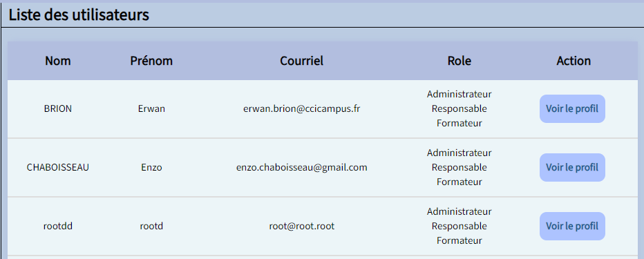

Il a dans ce tableau un visuel sommaire de chaque utilisateur. Il y a également tous les rôles attribués ou non à chaque utilisateur. Il est normal de voir des utilisateurs en attente de validation comme "dede" (sans rôle) et ceux déjà validé comme "rootdd" (avec un rôle).

Si vous souhaitez en savoir plus sur un utilisateur en particulier je vous propose de cliquer sur le bouton bleu "Voir le profil" de la ligne correspondante.

### La fiche personnelle d'un utilisateur :

Vous venez de cliquer sur le bouton "Voir le profil" d'un utilisateur contenu dans la liste des utilisateurs.

Voici le visuel type d'un utilisateur validé :

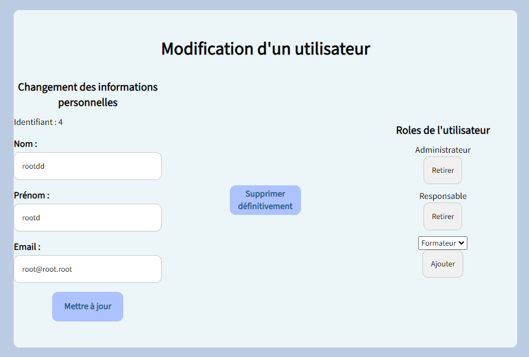

Vous verrez deux parties distinctes dans chacune des fiches personnelles. 

La première est les informations personnelles de l'utilisateur avec :

- son identifiant (ici "4")
- son nom
- son prénom
- son email

Dans cette première partie vous pouvez à tout moment décider de modifier une des informations cités précédemment en écrivant dans l'un des champs correspondant. Pensez à cliquer sur le bouton "Mettre à jour" pour que les changements soient pris en compte dans la base de donnée.

Et une seconde partie affichant les rôles détenus ou non par l'utilisateur en question. Pour ajouter un rôle il vous suffit de cliquer sur la barre déroulante, choisir un rôle, puis de cliquer sur le bouton gris "Ajouter". A l'inverse si vous voulez retirer un rôle à un utilisateur vous devez cliquer sur le bouton gris "Retirer" du rôle correspondant.

Si l'utilisateur possède déjà tous les rôles existants alors la barre déroulante disparaît et un message apparaît :

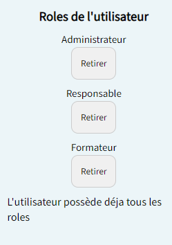

Pour supprimer un utilisateur définitivement de la base de donnée vous pouvez cliquer sur le bouton bleu "Supprimer définitivement". Attention cette action est irréversible, vous ne pourrez pas récupérer les informations de l'utilisateur supprimé et il devra faire une nouvelle demande d'inscription pour espérer accéder à l'application.

## Gestion des organismes :

### Les organismes en attente de validation : 

Lorsqu'un responsable pédagogique fait une demande de nom d'organisme, il doit attendre que l'administrateur la valide avant de pouvoir le voir.

C'est justement sur le lien "En attente" de "Validation" dans la barre de navigation du site que vous, administrateur, accèderez à la liste des demandes de nom d'organisme en attente.

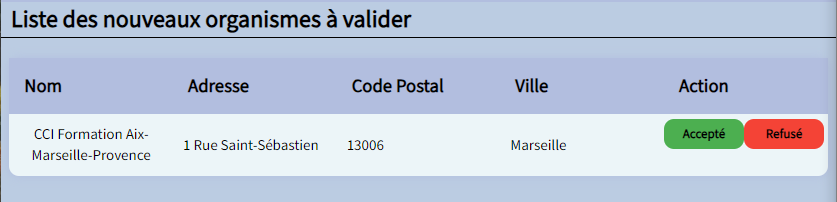

Lorsqu'un responsable pédagogique fait une demande de nom d'organisme il doit remplir plusieurs champs dont :

- Nom
- Adresse
- Code Postal
- Ville

Vous pouvez décider d'accepter cette demande en cliquant sur le bouton vert "Accepté" de la ligne correspondante ou la refusé en cliquant sur le bouton rouge "Refusé". 

Si jamais il y a une erreur dans la saisie comme une faute d'orthographe mais que vous voulez quand même le valider, sachez que vous pourrez modifier les informations de l'organisme dans sa fiche personnelle une fois l'organisme accepté (voir le chapitre nommé "la fiche personnelle d'un organisme").

Une fois l'organisme validé ou non, il disparaît de la liste des organismes en attente de validation.

### La liste des organismes :

Pour voir la liste des organismes contenus dans la base de donnée (validé ou non), vous devez cliquer sur le lien "Liste" de "Organismes" de la barre de navigation du site.

Vous tomberez sur cette page :

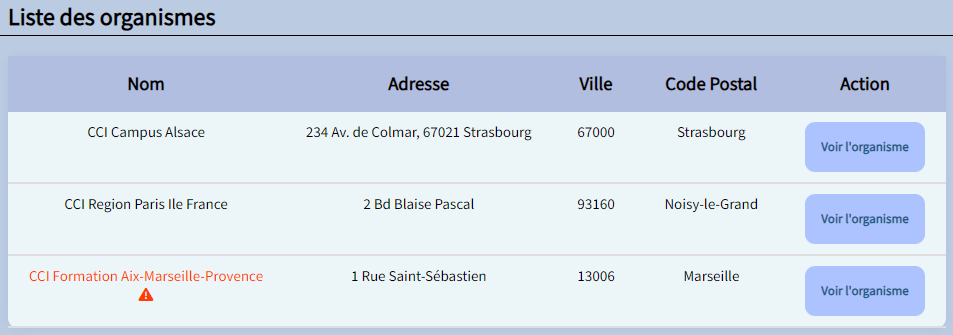

Il a dans ce tableau un visuel sommaire de chaque organisme. Il est normal de voir des organismes en attente de validation comme "CCI Formation Aix-Marseille-Provence" en rouge et ceux déjà validé comme "CCI Campus Alsace".

Si vous souhaitez en savoir plus sur un organisme en particulier je vous propose de cliquer sur le bouton bleu "Voir l'organisme" de la ligne correspondante.

### La fiche personnelle d'un organisme : 

Vous venez de cliquer sur le bouton "Voir l'organisme" d'un utilisateur contenu dans la liste des organismes.

Voici le visuel type de la fiche d'un organisme :

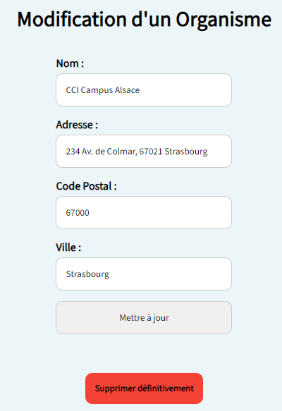 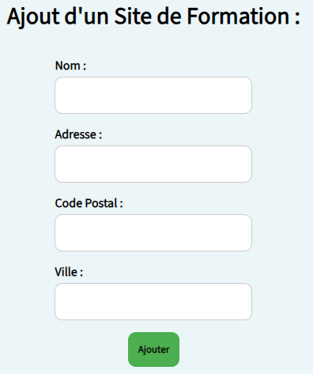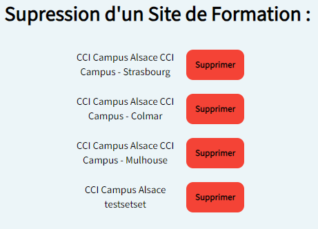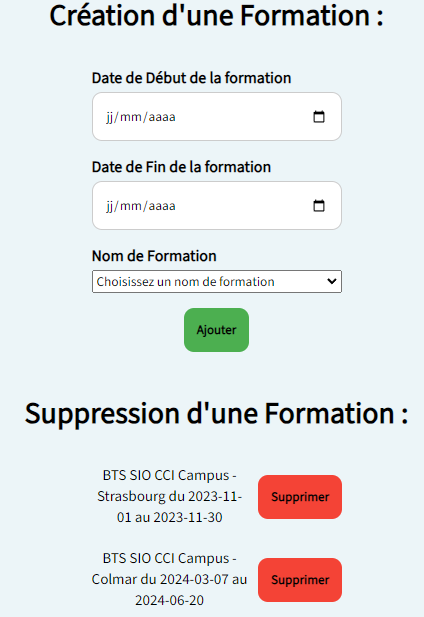

Vous verrez trois parties distinctes dans chacune des fiches personnelles. 

La première est sur les informations personnelles de l'organisme avec :

- son nom
- son adresse
- son code postal
- son ville

Dans cette première partie vous pouvez à tout moment décider de modifier une des informations cités précédemment en écrivant dans l'un des champs correspondant. Pensez à cliquer sur le bouton "Mettre à jour" pour que les changements soient pris en compte dans la base de donnée.

Pour supprimer un organisme définitivement de la base de donnée vous pouvez cliquer sur le bouton rouge "Supprimer définitivement". Attention cette action est irréversible, vous ne pourrez pas récupérer les informations de l'organisme supprimé et le responsable pédagogique devra faire une nouvelle demande de nom d'organisme.

La deuxième partie est l'association de sites de formation à l'organisme. 

Pour ajouter des sites de formation vous devez remplir les champs :

- nom
- adresse
- code postal
- ville

Puis cliquer sur le bouton vert "Ajouter". 

Si vous voulez supprimer un site, cliquez sur le bouton rouge correspondant dans "Suppression d'un site de formation. 

La troisième partie est sur l'association de formations à l'organisme. 

Pour ajouter des formations vous devez remplir la date de début et de fin de la formation, puis choisir une formation dans la barre déroulante. N'oubliez pas de cliquer sur le bouton vert "Ajouter". 

Pour supprimer une formation, cliquez sur le bouton rouge "Supprimer" correspondant dans "Suppression d'une formation. 

## Gestion des formations :

### La liste des formations :

Pour voir la liste des formations contenus dans la base de donnée, vous devez cliquer sur le lien "Liste" dans  "Formations" de la barre de navigation du site.

Vous tomberez sur cette page :

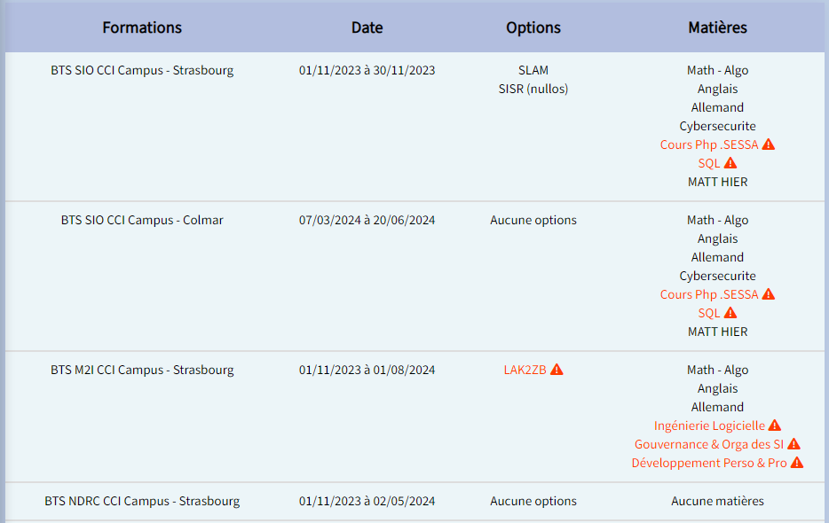

Vous retrouverez dans ce tableau le nom des formations (BTS SIO Campus Strasbourg), leurs dates de début et de fin (01/11/2023 à 30/11/2023), leurs options (SLAM et SISR) et enfin les matières.

Lorsque des options ou matières sont en rouge cela signifie qu'elles n'ont pas été encore validés.

Pour valider une matière ou une option rendez-vous dans les deux chapitres suivants de ce manuel ou dans la barre de navigation du site.

### Les matières en attente de validation : 

Lorsqu'un responsable pédagogique fait une demande de validation de nom de matière, ces demandes arrivent directement dans l'onglet "Matières en attente de validation" de l'administrateur.

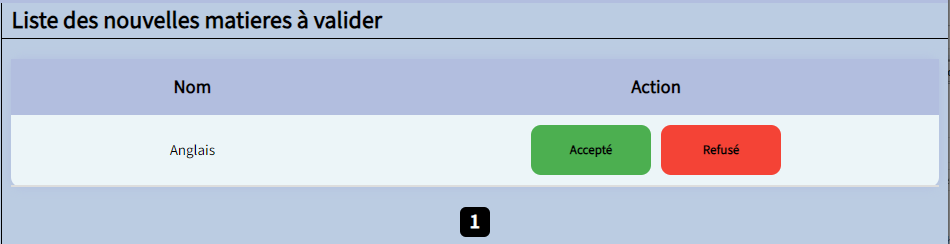

Pour accepter un nom de matière cliquer sur le bouton vert "Accepté". Si non, cliquer sur le bouton rouge "Refusé".

### Les options en attente de validation :

Lorsqu'un responsable pédagogique fait une demande de validation de nom d'options, ces demandes arrivent directement dans l'onglet "Options en attente de validation" de l'administrateur.

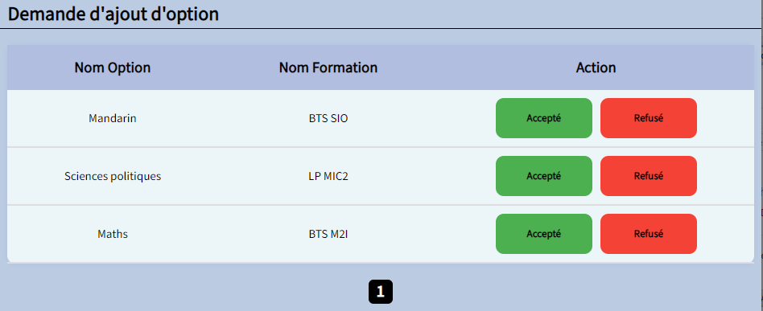

Pour accepter un nom d'options cliquer sur le bouton vert "Accepté". Si non, cliquer sur le bouton rouge "Refusé".
