# Manuel utilisateur : 

Date de modification : 10/01/2024

Auteur : Yanis STENTZEL

[toc]

## Authentification :

### Page de connexion :

Le formateur et le responsable pédagogique arrivent automatiquement sur la page de login après installation de l'application. Une adresse de connexion et son mot de passe vous serons nécessaires à la connexion, ces informations seront créées au moment de l'installation de l'application.

Vous devrez les renseigner dans les champs "E-mail" et "Mot de passe" avant de cliquer sur "Se connecter".

C'est sur cette page de login que vous trouverez également le lien pour la création de votre compte ainsi que le lien vers la page de mot de passe oublié.

### Page d'inscription :

La page d'inscription est nécessaire pour les responsables pédagogiques et les formateurs de rejoindre l'application. Pour toute inscription les mêmes champs sont à remplir :

- Nom
- Prénom
- Email 
- Mot de passe (à confirmer)

Une fois tous les champs remplis et que l'utilisateur à cliquer sur le bouton "S'inscrire" il n'y a plus qu'à attendre que l' administrateur valide la demande.

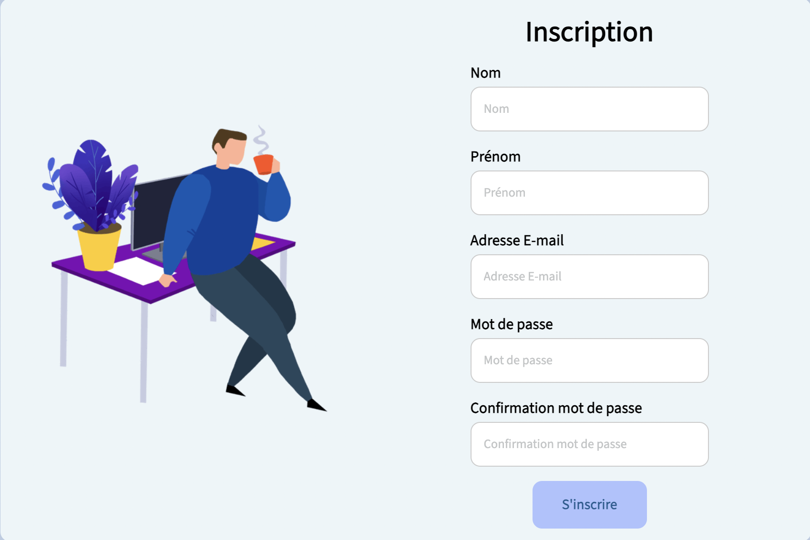

### Mot de passe oublié :

Le formateur et le responsable pédagogique pourront changer leur mot de passe en cliquant sur le lien en dessous des champs pour se connecter nommé "Mot de passe oublié ?". Une fois leur adresse mail de compte saisie, un email leur sera envoyé. Il faudra cliquer sur lien dans le mail reçu et vous pourrez renseigner votre nouveau mot de passe.

Vous n'aurez plus qu'à revenir sur la page de login de l'application pour vous connecter.

 

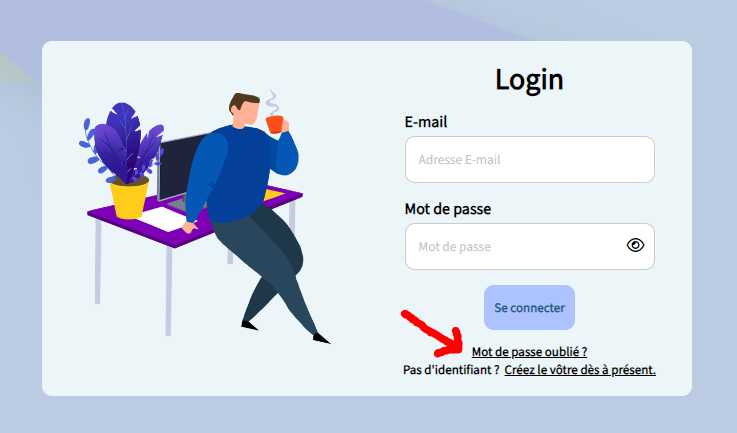

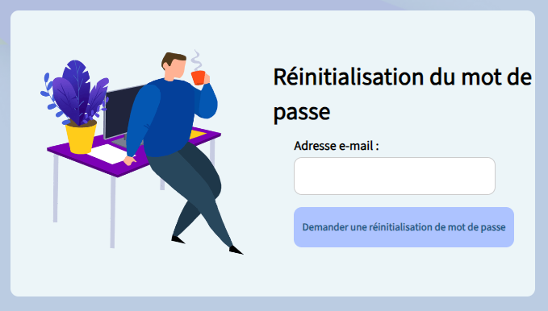

# Responsable pédagogique :

## Accueil :

### Barre de navigation :

Une fois connecté vous arrivez sur la page d'accueil avec un message de bienvenue.

Vous trouverez sur le côté gauche de la page la barre de navigation qui vous permettra de naviguer dans l'application.

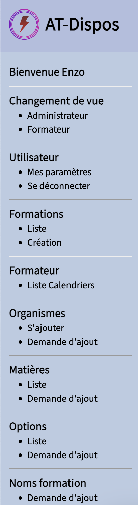

- Dans l'onglet "Formations" rubrique "Liste" vous retrouverez toutes les formations, que ce soit la date, les options, les matières ou les actions possibles (Voir la formation).
  Toujours dans le même onglet, rubrique "Création" vous aurez ici la création d'une formation en renseignant une date de début de la formation, une date de fin, le nom de formation et le site.

- Dans "Formateur" rubrique "Liste Calendriers" vous retrouverez les calendriers de vos formateurs avec le nom et la possibilité de consulter le calendrier associé.

- Dans "Organismes" rubrique "S'ajouter" vous aurez la page de tous les organismes avec les informations suivantes : Nom, Adresse, Code Postal, Ville et l'action qui laisse au responsable la possibilité de s'ajouter (demande qui sera soumise à l'administrateur). 
  En restant dans le même onglet, rubrique "Demande d'ajout" vous aurez la possibilité de soumettre une
  demande d'ajout d'un organisme.

- Dans "Matières" rubrique "Liste" vous aurez la page de toutes les matières avec les informations suivantes : Nom de la matière (aucune modification possible, page de consultation seulement). 
  En restant dans le même onglet, rubrique "Demande d'ajout" vous aurez la possibilité de soumettre une
  demande d'ajout d'une matière.

- Dans "Options" rubrique "Liste" vous aurez la page de toutes les options avec les informations suivantes : Nom de l'option associé à son nom de formation (aucune modification possible, page de consultation seulement). 
  En restant dans le même onglet, rubrique "Demande d'ajout" vous aurez la possibilité de soumettre une
  demande d'ajout d'une option.

- Dans "Noms Formation" rubrique "Demande d'ajout" vous aurez la possibilité de soumettre une demande d'ajout d'un nom de formation qui sera soumise à l'administrateur.

- Dans "Changement de vue" vous aurez ici la possibilité de changer votre statut (si vous avez les accès nécessaires), si vous êtes actuellement Responsable alors la possibilité de passer en Administrateur ou bien Formateur.

## Gestion des formations : 

### Création d'une Formation :

Quand un responsable pour but de créer une formation il va se diriger sur "Formations -> Création" dans sa navbar ! 

Il arrivera donc sur une page qui lui propose de séléctionner différentes informations :

- Date de Début de la formation dans le format jj/mm/aaaa.
- Date de Fin de la formation dans le format jj/mm/aaaa.
- Nom de la formation (à sélectionner dans la liste).
- Site de la fromation (à sélectionner dans la liste).

Après avoir séléctionné les différentes informations nécessaires il pourra cliquer sur le bouton "Demander", la demande sera soumise à l'administrateur pour validation.

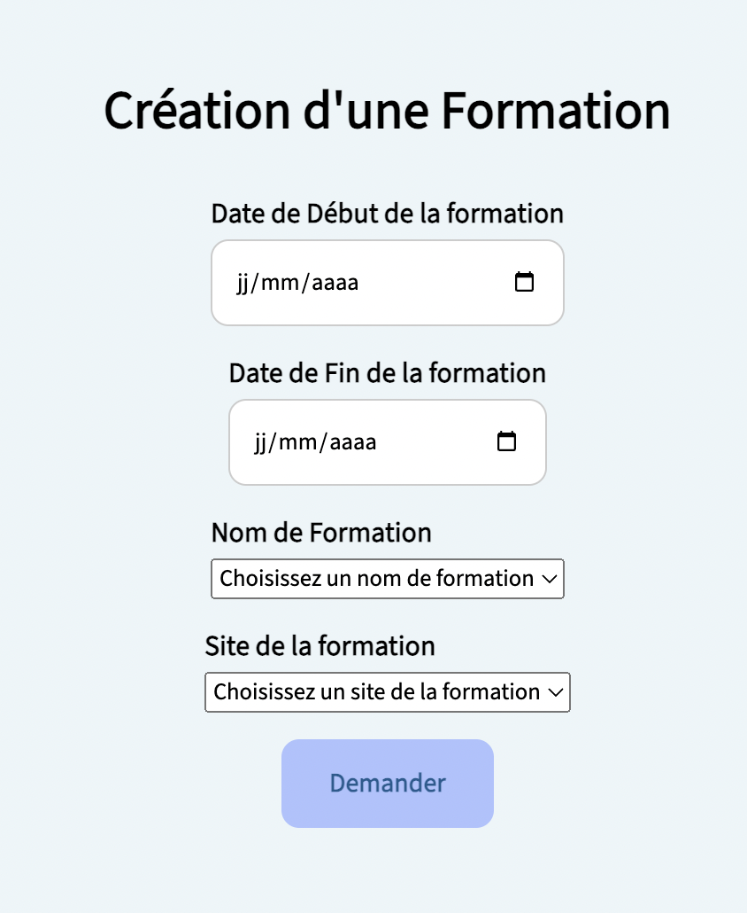

### Listing des formations et consultation : 

Après que l'administrateur ait validé la formation elle se trouvera donc dans "Formations -> Liste" dans sa navbar !

Il verra donc toutes les formations avec les informations suivantes :

- Le nom de la formation.
- La date de validité de la formation.
- Les options associées à la formation.
- Les matières associées aux matières.
- Le bouton pour voir la formation.

Le responsable cliquera donc sur "Voir la formation" pour accéder à d'autres actions.

On retrouvera sur cette page (les informations de la formation) les raccourcis pour y ajouter directement des matières ou des options (mais aussi celles déjà appliquées).

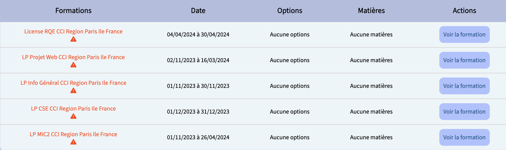

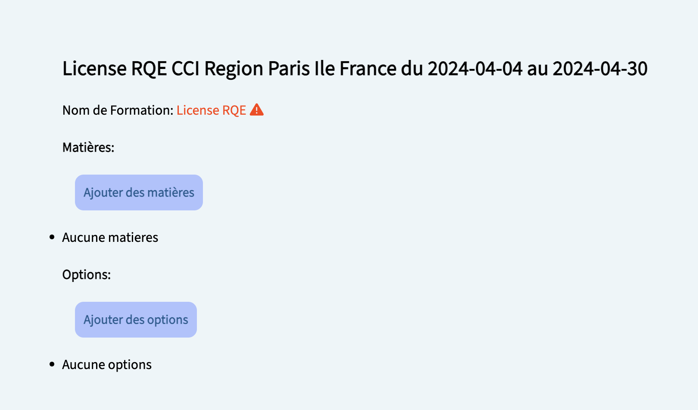

## Consultation Calendriers : 

Une fois que le/les formateur(s) a/ont soumis son/leur calendrier il/ils sera/seront consultable(s) pour le responsable sur la page suivante "Formateur -> Liste Calendriers" dans sa navbar !

En arrivant sur cette page le responsable verra sur la gauche le nom des formateurs avec l'année scolaire associée et aussi l'action de voir le calendrier.

En cliquant sur le bouton il accédera donc au calendrier du formateur choisi. Il verra le numéro de la semaine, la date du jour avec l'information associée à la demi-journée (MATIN - APRES-MIDI) comme possibilité :

- Indéfinie.
- Disponible.
- Pas disponible.
- Potentiellement dispo.

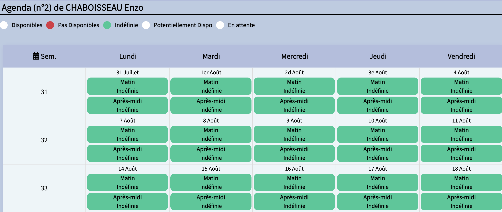 

## Gestion des organismes : 

### Ajout organisme :

Voici la partie la plus intéressante d'un responsable d'organisme : S'approprier son organisme.

En premier temps, il faut effectuer une demande d'ajout sur la page suivante "Organismes -> Demande d'ajout" dans la navbar !

Le responsable arrive donc sur une page qui lui demandera de remplir les informations suivantes :

- Nom de l'organisme
- Adresse de l'organisme
- Code Postal de l'organisme (chiffres uniquement)
- Ville de l'organisme

Il cliquera pour finir sur le bouton au bas de la page "Demander", le formulaire sera soumis à l'administrateur qui se chargera de le valider.

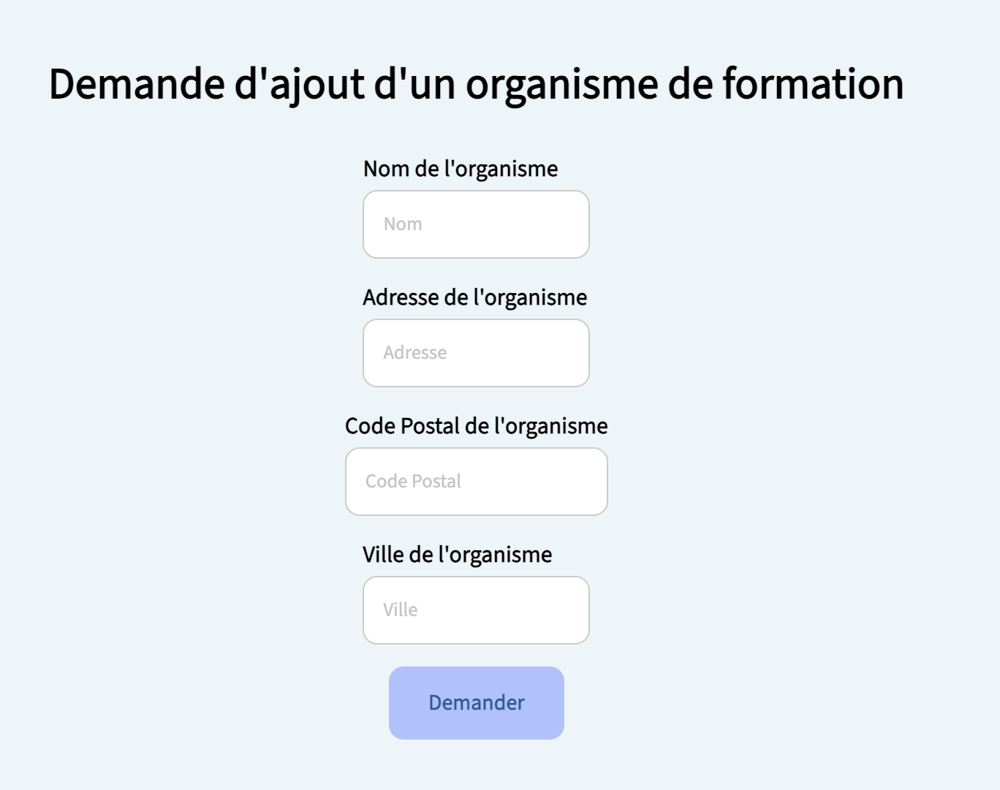  

### Attribution organisme :

Une fois la demande validée le responsable n'est pas automatiquement assigné à l'organisme (ATTENTION ⚠️).

Il devra se diriger vers la page "Organismes -> S'ajouter".

Arrivée sur la page, sa demande apparaîtra donc parmis la liste des orgnaismes disponibles. Les informations suivantes s'afficheront :

- Nom
- Adresse
- Code Postal
- Ville 
- Action (Ajouter)

Le responsable peut désormais cliquer sur "Ajouter" (le bouton vert), le message suivant apparaîtra : "Êtes-vous sûr de continuer?" 

Si il ne s'est pas trompé il pourra cliquer sur "Oui" et sera donc attribué automatiquement à l'organisme grâce au site.

(Si jamais il s'est trompé il pourra revenir en arrière en cliquant sur Non).

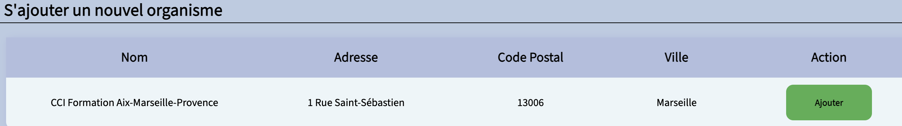

## Gestion des matières : 

### Ajout matière :

Une partie plus approfondie d'une formation ? C'est ajouter une matière.

En premier temps, il faut effectuer une demande d'ajout sur la page suivante "Matières -> Demande d'ajout" dans la navbar !

Le responsable arrive donc sur une page qui lui demandera de remplir les informations suivantes :

- Nom de la matière.

Il cliquera pour finir sur le bouton au bas de la page "Demander", le formulaire sera soumis à l'administrateur qui se chargera de le valider.

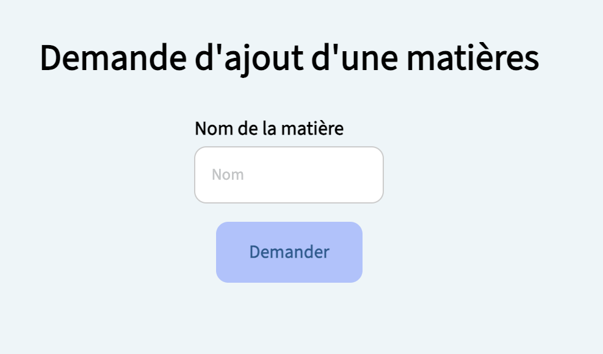  

### Liste matière :

Une fois la demande validée la matière est désormais disponible et peut être ajoutée dans la formation.

Il devra se diriger vers la page "Matières -> Liste" pour apercevoir les matières.

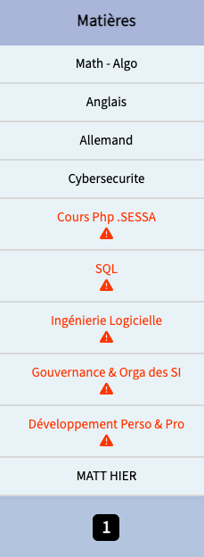

## Gestion des options : 

### Ajout option :

Une autre partie plus approfondie d'une formation ? C'est les options !

En premier temps, il faut effectuer une demande d'ajout sur la page suivante "Options -> Demande d'ajout" dans la navbar !

Le responsable arrive donc sur une page qui lui demandera de remplir les informations suivantes :

- Nom de l'option.

Et séléctionner parmis les différentes formations.

Il cliquera pour finir sur le bouton au bas de la page "Demander", le formulaire sera soumis à l'administrateur qui se chargera de le valider.

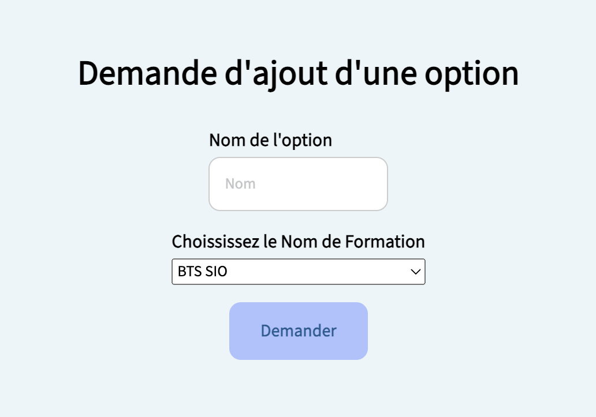  

### Liste option :

Une fois la demande validée l'option est désormais disponible et peut être ajoutée dans la formation.

Il devra se diriger vers la page "Options -> Liste" pour apercevoir les options associées à leur nom de formation.
                                                                                                                (Exemple : SLAM <-> BTS SIO)

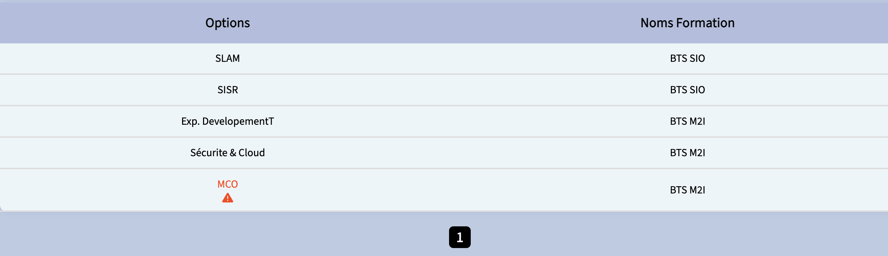

## Gestion des noms de formation : 

### Ajout nom de formation :

Et maintenant comment on fait pour ajouter à la liste de choix des noms de formation ? 

En premier temps, il faut effectuer une demande d'ajout sur la page suivante "Noms Formation-> Demande d'ajout" dans la navbar !

Le responsable arrive donc sur une page qui lui demandera de remplir les informations suivantes :

- Nom de la formation.

Il cliquera pour finir sur le bouton au bas de la page "Demander", le formulaire sera soumis à l'administrateur qui se chargera de le valider.

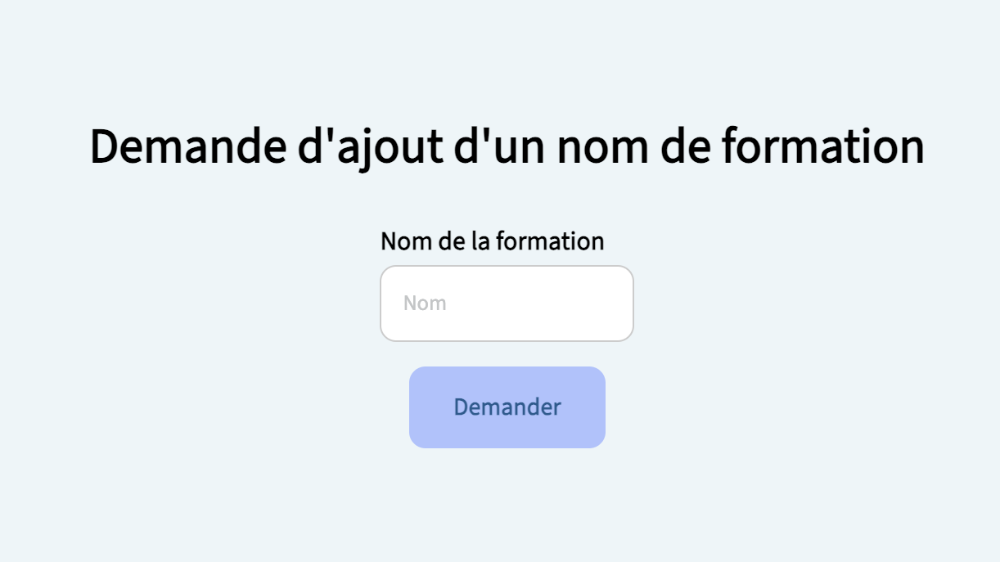  

### Liste nom de formation :

Une fois la demande validée le nom de formation est désormais disponible et est visible dans le choix des noms de formation (à la création d'une formation).

Il devra se diriger vers la page "Formations -> Création" pour apercevoir les noms de formations disponibles.

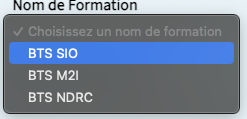

## Footer :

### Mentions légales :

Tout en bas du site vous verrez un lien "Mentions légales". Il vous redirigea vers les informations permettant d'identifier le responsable de l'application et les règles autour du droit d'auteur.

# Formateur :

## Accueil :

### Barre de navigation :

Une fois connecté vous arrivez sur la page d'accueil avec un message de bienvenue.

Vous trouverez sur le côté gauche de la page la barre de navigation qui vous permettra de naviguer dans l'application.

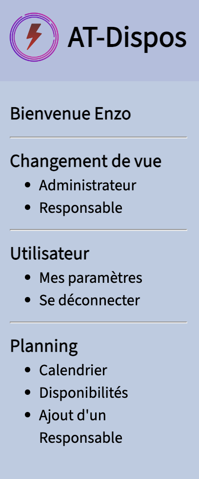

- Dans l'onglet "Planning" rubrique "Calendrier" vous retrouverez votre calendrier de formateur, que ce soit le numéro de la semaine, le jour (et le mois) divisé en deux parties : Matin et Après-midi avec son statut. 
  Toujours dans le même onglet, rubrique "Disponibilités" vous aurez ici la possibilité en tant que formateur de séléctionner pour chaque demi-journée votre statut et d'envoyer votre planning.
  
  Pour finir dans l'onglet 

- Dans "Changement de vue" vous aurez ici la possibilité de changer votre statut (si vous avez les accès nécessaires), si vous êtes actuellement Formateur alors la possibilité de passer en Administrateur ou bien Responsable.

## Planning 

### Calendrier 

Voici le calendrier/agenda que le formateur verra quand il souhaite le consulter, en haut de la page il verra les distinctions en couleur de ses demi-journées que ça soit du blanc, du vert ou bien du rouge. Mais avant de vouloir consulter son planning à jour il faudra ajouter ses propre disponibilités !

 

### Disponibilités

Désormais le formateur souhaite rajouter ses disponibilités et il devra le faire sur demi-journée : Matin et Après-midi.

En cliquant il aura la possibilité de choisir parmis ces possibilités : 

- Disponibles
- Pas Disponibles 
- Indéfinie 
- Potentiellement Dispo

Après avoir rempli toutes ses demi-journées il ne restera plus qu'au formateur de cliquer sur "Envoyer" ! Le responsable associé au formateur recevra un mail en pdf du planning.

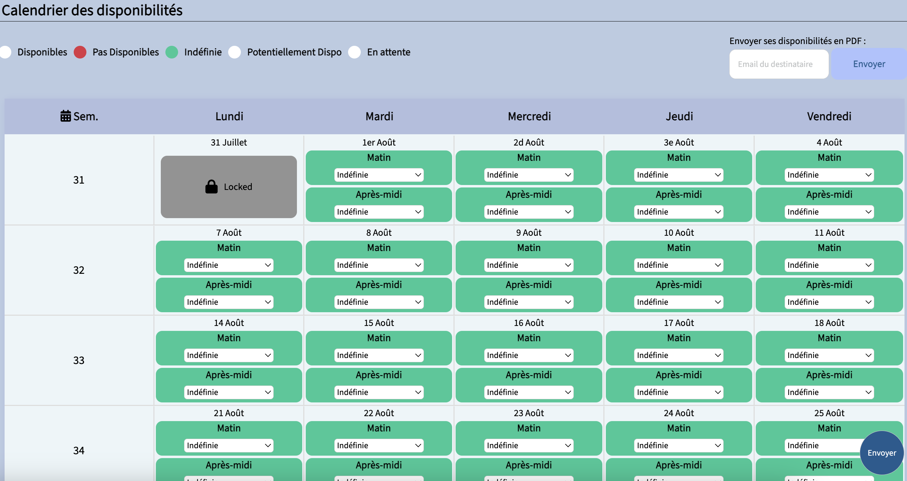 

### Ajout d'un responsable de planning

Comme écrit juste au-dessus un formateur a besoin de responsable à qui envoyer ses plannings. 

C'est donc dans cette page qu'il ajoutera ses responsables pour le calendrier de l'année scolaire. Si la page est vide alors il devra pour commencer choisir un calendrier puis rentrer le courriel du responsable qui recevera son planning en pdf. Il cliquera ensuite sur ajouter, à ce moment là quand il enverra son planning toutes les personnes dans la liste de la page au-dessus le recevront.

Si malencontreusement le formateur s'est raté sur le courriel il aura toujours la possibilité juste au-dessus dans "Action" de supprimer l'accès à la personne de son choix, la personne ne recevra donc plus les mails de son calendrier.

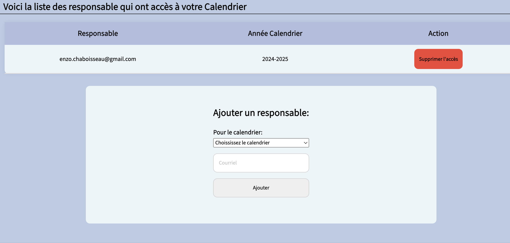 

## Footer :

### Mentions légales :

Tout en bas du site vous verrez un lien "Mentions légales". Il vous redirigea vers les informations permettant d'identifier le responsable de l'application et les règles autour du droit d'auteur.

